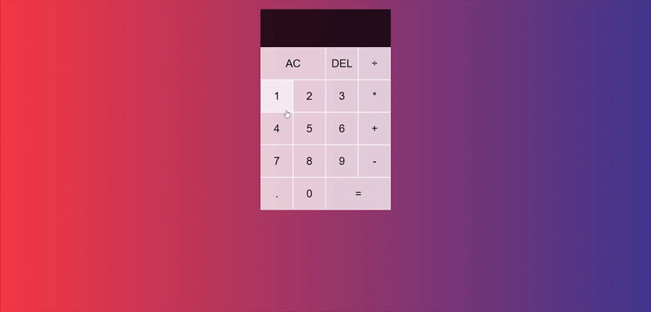

# 🪐 React Calculator

> Calculator App built with React.js for practicing functional components, state, reducer, and props.

## [Live Demo on Netlify](https://alexisintech-calculator.netlify.app/)

<!-- FEATURES -->

## ⭐ Features

- Standard calculator functionality (addition, subtraction, division, multiplication) with floating point calculations supported
- Use the DEL button to delete an integer or clear the input field if there is a single integer
- Use the AC button to clear the input field
- Allows operation chaining until the equal (=) sign is clicked, setting the input field to be the final solution of the calculations
- Integer formatting: comma's are added to proper placement in larger integers, multiple zero's cannot be placed on an empty input field, numbers cannot be prefixed with zero's unnecessarily but can have zero's following a decimal

<!-- BUILT WITH -->

## 🛠️ Built With

- React.js, Webpack, Babel
- HTML5/CSS3, Javascript ES6
- ESlint, Stylelint
- VSCode

<!-- GET YOUR OWN COPY -->

## 🌠 Get your own copy running!

- Clone using your preferred method 
- `npm i` 
- `npm start`

The page will reload if you make edits. 
You will also see any lint errors in the console.

<!-- TEA SPILL -->

## 🌝 Tea Spill
Creating this calculator was SUPER fun because it was my first time using useReducer. It was challenging to figure out that I could pass the dispatch through props of components, and how to pass the payload through calling that dispatch in the component. The HARDEST part of this project was the logic of the calculator, for example, thinking about edge cases such as handling when someone presses multiple 0's, they shouldn't appear on the screen because a standard calculator will only allow you to enter one zero if that's the only integer on the screen. I watched a tutorial to make sure I was catching the most common edge cases.
